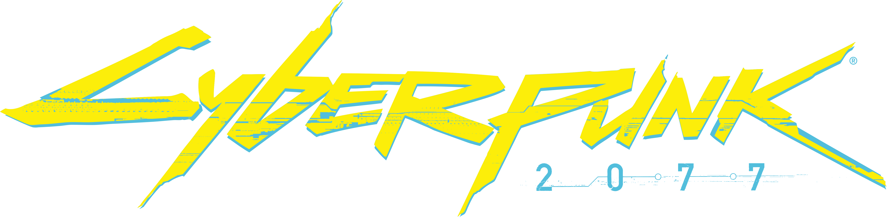
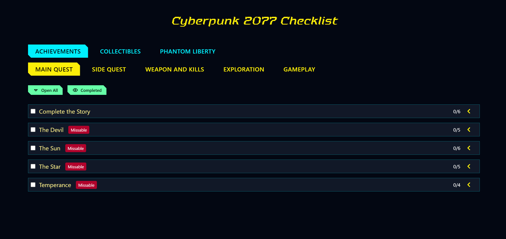

[![Issues][issues-shield]][issues-url]
[![MIT License][license-shield]][license-url]

<!-- PROJECT LOGO -->
<br />
<div align="center">
  <a href="https://mpaujan21.github.io/cyberpunk-2077-checklist/">
    
  </a>

<h3 align="center">Cyberpunk 2077 Checklist</h3>

  <p align="center">
    A checklist for Cyberpunk 2077. 
    <br />
    <br />
    <a href="https://mpaujan21.github.io/cyberpunk-2077-checklist/">Visit the website</a>
    ·
    <a href="https://github.com/mpaujan21/cyberpunk-2077-checklist/issues">Report Bug</a>
    ·
    <a href="https://github.com/mpaujan21/cyberpunk-2077-checklist/issues">Request Feature</a>
  </p>
</div>

<!-- TABLE OF CONTENTS -->
<details>
  <summary>Table of Contents</summary>
  <ol>
    <li>
      <a href="#about-the-project">About The Project</a>
      <ul>
        <li><a href="#built-with">Built With</a></li>
      </ul>
    </li>
    <li>
      <a href="#getting-started">Getting Started</a>
      <ul>
        <li><a href="#prerequisites">Prerequisites</a></li>
        <li><a href="#installation">Installation</a></li>
      </ul>
    </li>
    <li><a href="#usage">Usage</a></li>
    <li><a href="#issues-and-contributing">Issues and Contributing</a></li>
    <li><a href="#license">License</a></li>
    <li><a href="#acknowledgments">Acknowledgments</a></li>
  </ol>
</details>

<!-- ABOUT THE PROJECT -->

## About The Project

<a href="https://mpaujan21.github.io/cyberpunk-2077-checklist/">
  
</a>

This project is meant to allow you to explore the game on your own pace. Inspired by elden ring checklist. This website is to keep track and complete as much as possible through your playthrough, I hope that this website can help with that.

### Built With

- [Vite](https://vite.dev/)
- [Vue.js](https://vuejs.org/)
- [Tailwind CSS](https://tailwindcss.com/)
- [Tabler Icons](https://github.com/tabler/tabler-icons)

<!-- GETTING STARTED -->

## Getting Started

### Prerequisites

- [npm](https://nodejs.org/en/download/package-manager/)

### Installation

1. Clone the repo
   ```sh
   git clone https://github.com/mpaujan21/cyberpunk-2077-checklist.git
   ```
2. Install NPM packages
   ```sh
   npm install
   ```

<!-- USAGE EXAMPLES -->

## Usage

Run locally with:

```sh
   npm run dev
```

<!-- CONTRIBUTING -->

## Issues and Contributing

Contributions are greatly appreciated.

Please check out the [CONTRIBUTING.md](https://github.com/mpaujan21/cyberpunk-2077-checklist/blob/main/CONTRIBUTING.md) file for more detailed information on how to contribute.

<!-- LICENSE -->

## License

Distributed under the MIT License. See [LICENSE](https://github.com/mpaujan21/cyberpunk-2077-checklist/blob/main/LICENSE) for more information.

<!-- ACKNOWLEDGMENTS -->

## Acknowledgments

- [Elden Ring Checklist](https://gobluebro.github.io/Elden-Ring-Checklist/)
- [Best-README-Template](https://github.com/othneildrew/Best-README-Template)
- [Tabler Icons](https://github.com/tabler/tabler-icons)
- [Github Pages](https://pages.github.com/)
- [Contributing.md Template](https://github.com/necolas/issue-guidelines)

<!-- MARKDOWN LINKS & IMAGES -->
<!-- https://www.markdownguide.org/basic-syntax/#reference-style-links -->

[issues-shield]: https://img.shields.io/github/issues/mpaujan21/cyberpunk-2077-checklist.svg?style=for-the-badge
[issues-url]: https://github.com/mpaujan21/cyberpunk-2077-checklist/issues
[license-shield]: https://img.shields.io/github/license/mpaujan21/cyberpunk-2077-checklist.svg?style=for-the-badge
[license-url]: https://github.com/mpaujan21/cyberpunk-2077-checklist/blob/main/LICENSE
